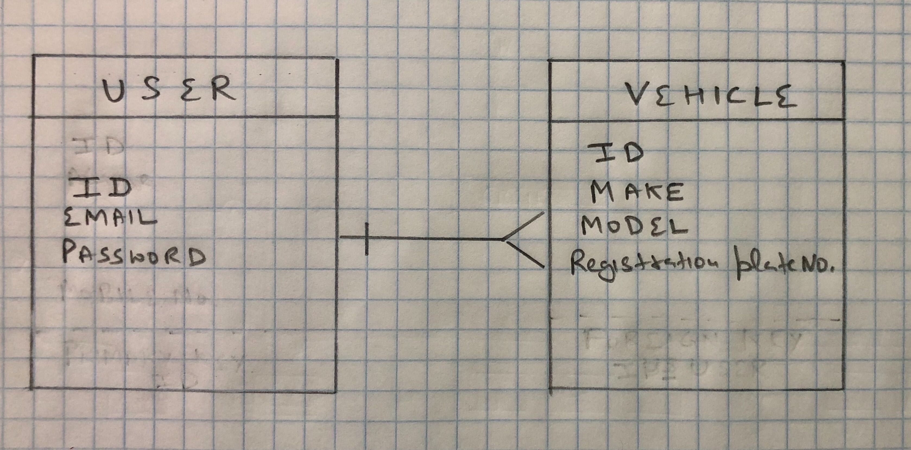

# parking-lot-registration (backend)

### Repository link: https://github.com/khalsaniwas/parking-lot-registration

Parking lot registration is a back end application programming interface. Single user can register multiple vehicles under their name at frontend. All requests sent by user must go through authentication which is achieved by sending ajax requests coming from frontend application. User send a request to server which is database connected thorugh back end application. Api responds back to those requests and provides the data that user is looking to see in web browser, Vehicles information in case of this application. Requests require a token for authentication, which is a unique identifier.

## parking-lot-registration - client(frontend client)

### ### Repository link: https://github.com/khalsaniwas/parking-lot-registration-client

## Link to deployed sites

### Production site link: https://parking-lot-registration.herokuapp.com/

### Development site link: http://localhost:4741/

## Entity relationship diagram

## Technologies used

Github
Atom
Ruby
Ruby on rails
visual studio code
Terminal
web browser
dev tool
PostgreSQL
psql
heroku
curl scripts

## [License](LICENSE)

1.  All content is licensed under a CC­BY­NC­SA 4.0 license.
1.  All software code is licensed under GNU GPLv3. For commercial use or
    alternative licensing, please contact legal@ga.co.
